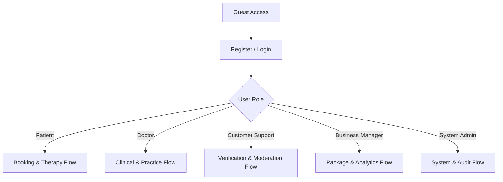
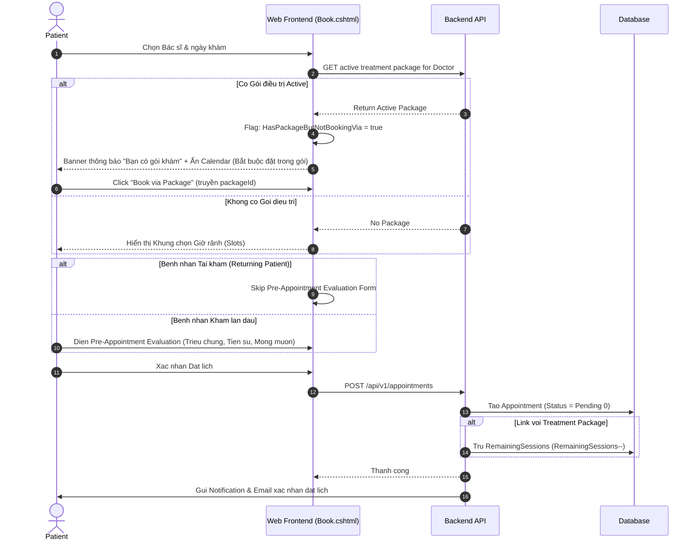
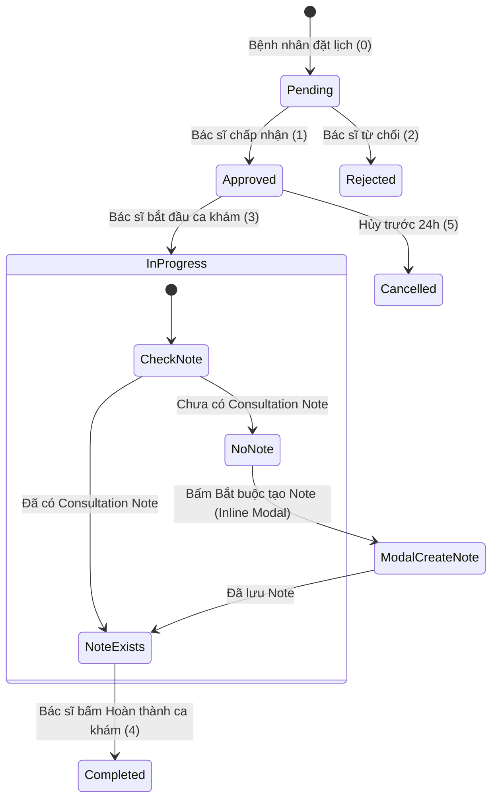
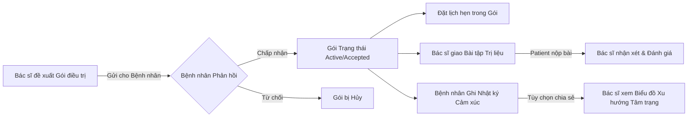
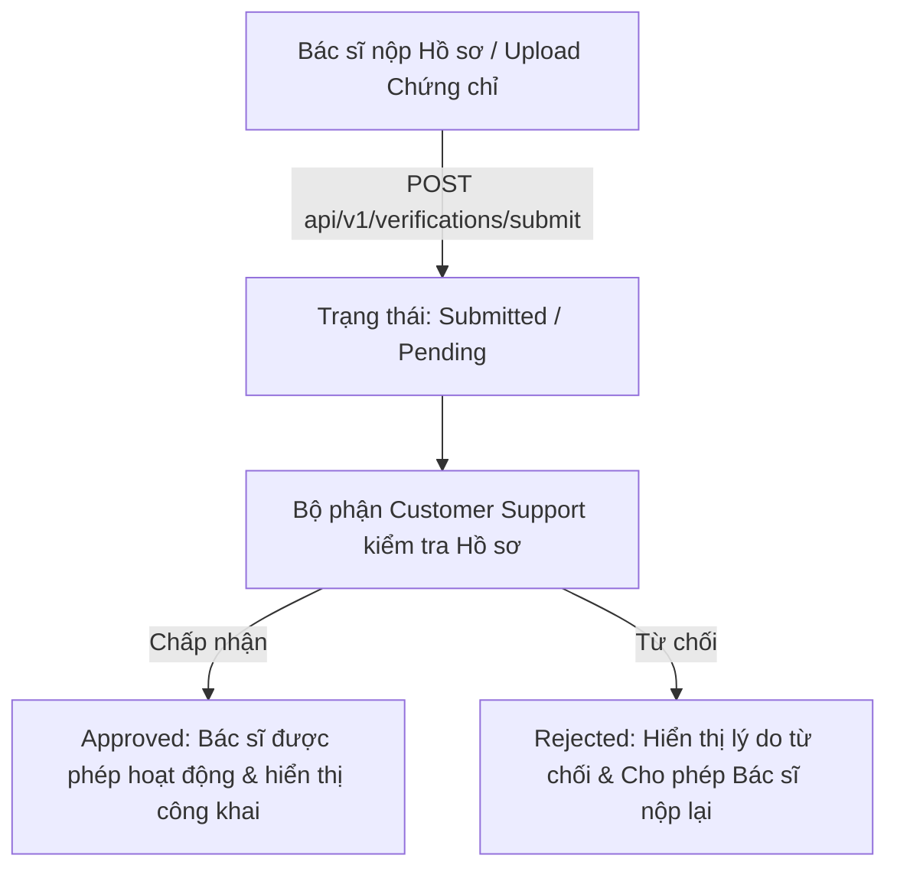

# Tổng Quan Luồng Chức Năng Hiện Tại Dự Án OPCBS (MindBridge)

> **Ngày cập nhật:** 22/07/2026  
> **Tài liệu mục đích:** Tổng hợp chi tiết toàn bộ luồng nghiệp vụ, kiến trúc dữ liệu, giao diện, quy tắc xử lý (business rules) và trạng thái hiện tại của hệ thống **OPCBS (MindBridge)** nhằm phục vụ quá trình cải tiến và tối ưu hóa chức năng.

---

## I. TỔNG QUAN KIẾN TRÚC & PHÂN QUYỀN

### 1. Kiến trúc Kỹ thuật
* **Backend:** ASP.NET Core 8 Web API (Clean Architecture / Layered Architecture with Generic Repository & Unit of Work).
* **Frontend:** Razor Pages (Decoupled Web Client gọi API thông qua `HttpClient` và Service Gateway Layer).
* **Xác thực (Authentication):**
  * JWT Bearer Token được cấp từ API khi Login và lưu tại Cookie `OPCBS.JwtToken`.
  * Cookie xác thực Razor Pages: `OPCBS.Auth` (chế độ `SameAsRequest` thích ứng cả HTTP Dev & HTTPS Prod).
* **Điều hướng & Giao diện (Navigation & Layout):**
  * Sidebar cũ đã bị gỡ bỏ toàn bộ. Hệ thống sử dụng căn giữa tiêu chuẩn (`container py-4`).
  * Toàn bộ chức năng quản trị và điều hướng cá nhân của cả 6 Roles được tích hợp gọn gàng trong **Dropdown Menu Hồ sơ (Top-right Profile Menu)** ở Thanh Header (`_Header.cshtml`).

### 2. Danh sách 6 Vai trò (Roles) trong Hệ thống
1. **Guest (Khách / Chưa đăng nhập):** Xem trang chủ, tìm kiếm thông tin bác sĩ, đọc bài viết blog, đăng ký/đăng nhập.
2. **Patient (Bệnh nhân):** Đặt lịch hẹn, làm bài sàng lọc tâm lý, xem lịch sử khám, quản lý gói điều trị, ghi nhật ký cảm xúc, làm bài tập trị liệu.
3. **Doctor (Bác sĩ / Chuyên gia):** Xác minh hồ sơ hành nghề, đăng ký gói dịch vụ nền tảng, quản lý lịch rảnh/slot, tiếp nhận & thực hiện ca khám, tạo ghi chú tư vấn, giao bài tập trị liệu, quản lý hồ sơ bệnh nhân.
4. **Customer Support (CS - Hỗ trợ khách hàng):** Duyệt đơn xác minh bác sĩ (Doctor Verification), kiểm duyệt bài viết Blog (Blog Moderation).
5. **Business Manager (BM - Quản lý kinh doanh):** Quản lý chuyên khoa (Specializations), quản lý các gói dịch vụ nền tảng cho Bác sĩ (Platform Service Packages), xem phân tích & báo cáo doanh thu.
6. **System Admin (Quản trị viên hệ thống):** Quản lý tài khoản & phân quyền (Users & Roles), xem nhật ký thao tác (Audit Logs), cấu hình tham số hệ thống (System Configs), báo cáo tổng quan.

---

## II. CHI TIẾT CÁC LUỒNG CHỨC NĂNG (FUNCTIONAL FLOWS)

---

### LUỒNG 1: XÁC THỰC & QUẢN LÝ TÀI KHOẢN (AUTH & IDENTITY)

#### 1. Các bước thực hiện (Workflow)
1. **Đăng ký Tài khoản Patient / Doctor:**
   * Người dùng truy cập `/Account/Register` hoặc `/Account/RegisterDoctor`.
   * Hệ thống tạo tài khoản với trạng thái `Pending/IsEmailVerified = false` và gửi mã OTP qua Email (`IEmailService.SendOtpEmailAsync`).
   * Người dùng chuyển hướng sang `/Account/VerifyOtp` để nhập OTP 6 chữ số xác nhận.
2. **Đăng nhập (Login):**
   * Người dùng truy cập `/Account/Login`, nhập Email & Password.
   * API xác thực credential và trả về JWT Access Token.
   * Client lưu Token vào cookie `OPCBS.JwtToken` và tạo phiên đăng nhập Cookie ASP.NET Identity.
3. **Quên & Đặt lại mật khẩu (Forgot / Reset Password):**
   * Yêu cầu gửi mail chứa link/token đặt lại mật khẩu tại `/Account/ForgotPassword`.
   * Đặt lại mật khẩu mới tại `/Account/ResetPassword`.
4. **Quản lý Hồ sơ Cá nhân (Profile Management):**
   * Thay đổi thông tin cá nhân (Họ tên, SĐT, Avatar) tại `/Account/Profile`.
   * Đổi mật khẩu tại `/Account/ChangePassword`.

#### 2. Mã nguồn & API liên quan
* **Razor Pages:** `Pages/Account/Login.cshtml`, `Register.cshtml`, `RegisterDoctor.cshtml`, `VerifyOtp.cshtml`, `Profile.cshtml`, `ForgotPassword.cshtml`, `ResetPassword.cshtml`.
* **API Endpoints:** `POST api/v1/auth/login`, `register`, `register-doctor`, `verify-otp`, `forgot-password`, `reset-password`, `change-password`.
* **Services:** `AuthService.cs` (Backend), `AuthApiService.cs` (Web).

---

### LUỒNG 2: TÌM KIẾM & ĐẶT LỊCH HẸN KHÁM (BOOKING & APPOINTMENT FLOW)

#### 1. Chi tiết Luồng Đặt lịch (Booking Workflow)

#### 2. Quy tắc Nghiệp vụ Đặt lịch (Business Rules)
1. **Khấu trừ phiên Gói điều trị tự động (Package Auto-Deduction):**
   * Khi đặt lịch hẹn gắn kèm `TreatmentPackageId`, số phiên còn lại `RemainingSessions` của gói tự động trừ đi 1.
   * Nếu bệnh nhân không chọn gói nhưng có gói Active hợp lệ với bác sĩ đó, Backend sẽ tự động Fallback gán gói và khấu trừ phiên.
2. **Khóa đặt ngoài gói (Block Booking Outside Package):**
   * Nếu bệnh nhân đang sở hữu Gói điều trị với bác sĩ đó, giao diện hiển thị banner cảnh báo và **ẩn hoàn toàn lịch đặt công khai**. Bệnh nhân bắt buộc phải chọn "Đặt lịch trong gói".
3. **Phân biệt Khám lần đầu vs. Tái khám (Returning Patient Flow):**
   * Bệnh nhân đã từng hoàn thành ít nhất 1 ca khám với Bác sĩ (`VisitCount > 0`) được gắn nhãn `Returning Patient`.
   * Trang đặt lịch sẽ **tự động bỏ qua (skip)** phần điền thông tin Đánh giá sơ bộ trước buổi khám (Pre-Appointment Evaluation) và hiển thị banner "Welcome back!".
   * Trang Chi tiết lịch hẹn đã hoàn thành của bệnh nhân có thêm nút **"Book Follow-up"** nhanh.
4. **Quy định Hủy lịch 24h (24-Hour Cancellation Policy):**
   * Cả Bác sĩ và Bệnh nhân chỉ được hủy lịch hẹn **trước giờ khám ít nhất 24 tiếng**.
   * Khi hủy lịch: Slot khám được giải phóng về lại trạng thái `Available`; nếu lịch gắn liền với Gói điều trị thì `RemainingSessions` của gói sẽ được hoàn lại (+1).
   * Hệ thống tự động gửi thông báo In-app và Email cho bên còn lại.

#### 3. Mã nguồn & API liên quan
* **Razor Pages:** `Pages/Appointment/Book.cshtml`, `Pages/Patient/Appointments/Index.cshtml`, `Details.cshtml`.
* **API Endpoints:** `POST api/v1/appointments`, `GET api/v1/appointments/my-appointments`, `PUT api/v1/appointments/{id}/cancel`, `GET api/v1/appointments/is-returning/{doctorId}`.
* **Services:** `DoctorAppointmentServices.cs`, `AppointmentApiService.cs`.

---

### LUỒNG 3: QUẢN LÝ LỊCH VÀ KHÁM TƯ VẤN CỦA BÁC SĨ (DOCTOR CLINICAL WORKFLOW)

#### 1. Quản lý Lịch rảnh & Ngày nghỉ (Schedules & Slots)
* Bác sĩ tạo khung giờ khám rảnh (Slots) theo ngày/tuần tại `/Doctor/Schedules`.
* Bác sĩ có thể bật/tắt khóa slot (`toggle-block`), ghi chú slot, hoặc đăng ký ngày nghỉ (`ScheduleDaysOff`).

#### 2. Tiến trình Ca khám & Rào cản Hoàn thành (Appointment State Machine & Completion Guard)

* **Rào cản Bắt buộc có Ghi chú tư vấn (Consultation Note Completion Guard):**
  * Bác sĩ **không thể** đổi trạng thái lịch hẹn sang `Completed` nếu chưa có bài ghi chú tư vấn (`ConsultationNote`) tương ứng.
  * Trang `Doctor/Appointments/Details` tích hợp sẵn **Inline Modal (`#createNoteModal`)**, cho phép bác sĩ điền chẩn đoán, đánh giá, kế hoạch trị liệu và bấm "Lưu Note & Hoàn thành ca khám" trong cùng 1 thao tác.
* **Gợi ý Ngày tái khám (Follow-up Date Recommendation):**
  * Trong Consultation Note, Bác sĩ có thể điền trường `NextAppointmentRecommendedDate`.
  * Hệ thống có Background Job (`AppointmentReminderService`) chạy định kỳ 5 phút/lần, tự động quét và gửi mail/thông báo nhắc bệnh nhân trước 1 ngày so với ngày hẹn tái khám.
* **Thông tin Bệnh nhân Tái khám trên Trang Chi tiết của Bác sĩ:**
  * Trang chi tiết lịch hẹn của Bác sĩ tự động tổng hợp: Số lần đã khám (`VisitCount`), Ghi chú tư vấn gần nhất (`LatestConsultationNote`), Gói điều trị đang hoạt động (`ActiveTreatmentPackage`), Bài làm sàng lọc tâm lý (`PsychometricSubmission`).

#### 3. Mã nguồn & API liên quan
* **Razor Pages:** `Pages/Doctor/Schedules/Index.cshtml`, `Pages/Doctor/Appointments/Index.cshtml`, `Details.cshtml`, `Pages/Doctor/ConsultationNotes/*`, `Pages/Doctor/Patients/*`.
* **API Endpoints:** `POST api/v1/schedules/slots`, `PUT api/v1/appointments/{id}/start`, `PUT api/v1/appointments/{id}/complete`, `POST api/v1/consultation-notes`.

---

### LUỒNG 4: GÓI ĐIỀU TRỊ & TRỊ LIỆU CHUYÊN SÂU (TREATMENT PACKAGES & THERAPY)

#### 1. Chi tiết Luồng Nghiệp vụ Trị liệu

1. **Gói Điều trị (Treatment Package):**
   * Bác sĩ tạo gói trị liệu chuyên sâu cho bệnh nhân (gồm tên gói, số lượng buổi `SessionQuantity`, nội dung cam kết).
   * Bệnh nhân nhận thông báo và bấm Chấp nhận (`Accepted`) hoặc Từ chối (`Rejected`).
   * Mỗi lần đặt lịch trong gói, `RemainingSessions` giảm 1. Nút trên trang lịch hẹn tự động chuyển từ "Tạo gói khám" thành "Chi tiết gói khám".
2. **Bài tập Trị liệu (`TherapyAssignment`):**
   * Bác sĩ tạo bài tập gắn liền với Gói điều trị.
   * Trạng thái bài tập: `0 (Chưa làm)` -> `1 (Đã nộp bài)` -> `2 (Bác sĩ đã đánh giá)`.
3. **Nhật ký Cảm xúc (`EmotionJournal`):**
   * Bệnh nhân ghi chép tâm trạng hàng ngày: `MoodScale (1-5)`, `StressScale (1-5)`, ghi chú cá nhân.
   * Tùy chọn `IsShared`: Cho phép Bác sĩ theo dõi biểu đồ xu hướng cảm xúc (sử dụng Chart.js).

#### 2. Mã nguồn & API liên quan
* **Razor Pages:** `Pages/Doctor/TreatmentPackages/*`, `Pages/Patient/TreatmentPackages/*`, `Pages/Patient/Journal/*`, `Pages/Patient/Therapy/*`.
* **API Endpoints:** `api/v1/treatment-packages/*`, `api/v1/therapy/assignments/*`, `api/v1/therapy/journals/*`.

---

### LUỒNG 5: SÀNG LỌC TÂM LÝ (PSYCHOMETRICS FLOW)

1. **Thực hiện Bài kiểm tra:**
   * Bệnh nhân chọn làm bài test sàng lọc (DASS-21, GAD-7, PHQ-9, MBTI...) tại `/Patient/Psychometrics`.
   * Trả lời danh sách câu hỏi trắc nghiệm, hệ thống tính toán tổng điểm và đưa ra Mức độ (Severity Level) + Khuyên dùng.
2. **Lưu trữ & Hiển thị kết quả:**
   * Nếu bệnh nhân làm bài test trước khi đặt lịch hoặc trong khi đặt lịch, kết quả bài test (`PsychometricSubmission`) được liên kết trực tiếp với Lịch hẹn.
   * Bác sĩ có thể xem chi tiết câu trả lời và mức độ rủi ro ngay trên trang Chi tiết lịch hẹn.
   * Bệnh nhân có nút **"Retake (Làm lại bài test)"** trên trang chi tiết lịch hẹn của mình.

---

### LUỒNG 6: XÁC MINH HỒ SƠ HÀNH NGHỀ BÁC SĨ (DOCTOR VERIFICATION)

1. **Nộp hồ sơ:** Bác sĩ nhập Chuyên khoa, Học vị, Số giấy phép hành nghề, Số năm kinh nghiệm, Upload file chứng chỉ (PDF/JPG/PNG) tại `/Doctor/Verification`.
2. **Trình xem chứng chỉ (Certificate Viewer):** Trang hiển thị chứng chỉ hỗ trợ xem ảnh trực tiếp (Inline Image Preview), nhúng khung xem PDF (Embedded PDF Viewer) và tải về.
3. **Phê duyệt:** Nhân viên CS truy cập `/CustomerSupport/DoctorApplications` để duyệt (`Approve`) hoặc từ chối (`Reject` kèm lý do).

---

### LUỒNG 7: GÓI DỊCH VỤ BÁC SĨ & THANH TOÁN VNPAY (DOCTOR SUBSCRIPTIONS & VNPAY)

1. **Đăng ký Gói nền tảng (Service Package):** Bác sĩ chọn gói dịch vụ theo tháng/năm để hoạt động trên nền tảng tại `/Doctor/ServicePackages`.
2. **Tích hợp Cổng thanh toán VNPay Sandbox:**
   * Hệ thống tạo URL thanh toán VNPay kèm chữ ký bảo mật HMAC-SHA512.
   * Bác sĩ chuyển hướng sang cổng VNPay Sandbox để thanh toán.
   * Sau khi hoàn tất, VNPay chuyển hướng về `/Doctor/Subscriptions/PaymentCallback`.
   * Backend xác thực chữ ký callback, hủy các gói cũ (`Expired`), kích hoạt gói mới (`Active`), cập nhật giao dịch `PaymentTransaction` thành `Success`.

---

### LUỒNG 8: QUẢN TRỊ HỆ THỐNG & ĐIỀU HÀNH BỆNH VIỆN/PLATFORM (ADMIN, CS, BM FLOWS)

#### 1. Customer Support (CS):
* Duyệt đơn xác minh bác sĩ (`DoctorApplications`).
* Kiểm duyệt & Xuất bản bài viết Blog của Bác sĩ (`BlogModeration`).

#### 2. Business Manager (BM):
* Quản lý Danh mục Chuyên khoa (`Specializations`).
* Quản lý Các gói dịch vụ nền tảng bán cho Bác sĩ (`ServicePackages`).
* Xem báo cáo phân tích kinh doanh, tăng trưởng bác sĩ & doanh thu thanh toán.

#### 3. System Admin:
* Quản lý Danh sách Người dùng (`Users`), Khóa/Mở khóa tài khoản, Phân quyền vai trò (`Roles & Permissions`).
* Nhật ký Hoạt động Hệ thống (`AuditLogs`): Theo dõi ai đã làm gì, tác động lên Entity nào, thời gian nào.
* Cấu hình Tham số Hệ thống (`SystemConfigs`): Cấu hình SMTP Email, Phiên làm việc, Số lần đăng nhập sai, Bảo trì.

---

## III. THỰC THỂ & BẢNG MÃ TRẠNG THÁI (STATUS ENUM MAPPINGS)

| Thực thể (Entity) | Trường trạng thái | Các giá trị Enum & Ý nghĩa |
|---|---|---|
| **Appointment** | `Status` | `0: Pending` (Chờ duyệt) `1: Approved` (Đã chấp nhận) `2: Rejected` (Từ chối) `3: InProgress` (Đang khám) `4: Completed` (Đã hoàn thành) `5: Cancelled` (Đã hủy) |
| **VerificationRequest** | `Status` | `Submitted` (Đã nộp) `Pending` (Chờ duyệt) `Approved` (Đã duyệt) `Rejected` (Từ chối) |
| **TreatmentPackage** | `Status` | `0: Proposed/Pending` (Đề xuất) `1: Accepted/Active` (Đã chấp nhận) `2: Rejected` (Từ chối) `3: Completed` (Đã xong) `4: Cancelled` (Đã hủy) |
| **TherapyAssignment** | `Status` | `0: Pending` (Mới giao/Chưa làm) `1: Submitted` (Đã nộp bài) `2: Reviewed` (Bác sĩ đã đánh giá) |
| **DoctorSubscription** | `Status` | `Active` (Đang hiệu lực) `Expired` (Hết hạn) `Cancelled` (Đã hủy) |
| **PaymentTransaction** | `Status` | `Pending` (Chờ thanh toán) `Success` (Thành công) `Failed` (Thất bại) |
| **BlogPost** | `Status` | `Draft` (Bản nháp) `Pending` (Chờ CS duyệt) `Published` (Đã xuất bản) `Rejected` (Từ chối) |

---

## IV. ĐÁNH GIÁ HIỆN TRẠNG & CÁC ĐIỂM CẦN CẢI TIẾN (AREAS FOR IMPROVEMENT)

Dựa trên việc rà soát toàn bộ luồng chức năng, dưới đây là các điểm cần tập trung nâng cấp và cải tiến trong giai đoạn tiếp theo:

### 1. Luồng Đặt lịch & Quản lý Lịch hẹn (Booking & Appointments)
* [ ] **Cải tiến luồng chọn Slot:** Hiện tại giao diện chọn khung giờ khám trên trang Book vẫn dạng dropdown/danh sách đơn giản, cần nâng cấp lên giao diện Lịch trực quan (Calendar Grid/Time slot picker).
* [ ] **Nhắc nhở cuộc họp trực tuyến:** Tích hợp link video call (ví dụ: Google Meet/Jitsi/Agora) tự động tạo khi hẹn lịch được duyệt và hiển thị nút "Join Session" khi lịch đến trạng thái `InProgress`.
* [ ] **Đánh giá & Review Bác sĩ:** Cho phép Bệnh nhân gửi Đánh giá (Rating 1-5 sao + Comment) sau khi lịch hẹn hoàn thành (`Status = Completed`).

### 2. Luồng Trị liệu & Tương tác Bác sĩ - Bệnh nhân (Therapy & Engagement)
* [ ] **Tương tác Bài tập Trị liệu:** Thêm khả năng đính kèm file/hình ảnh khi bệnh nhân nộp bài tập trị liệu.
* [ ] **Thống kê & Cảnh báo Sức khỏe Tâm thần:** Cảnh báo tự động cho Bác sĩ khi Nhật ký Cảm xúc của Bệnh nhân có mức độ Stress cao hoặc Mood thấp liên tục 3 ngày.

### 3. Luồng Quản trị & Báo cáo (Admin & CS & BM)
* [ ] **Export Báo cáo Data (Excel/PDF):** Thêm chức năng xuất báo cáo danh sách lịch hẹn, doanh thu gói khám, danh sách bác sĩ ra file Excel/CSV cho Business Manager & Admin.
* [ ] **Phân quyền Chi tiết (Fine-grained Permissions):** Hoàn thiện UI gán quyền cụ thể (`Permissions`) cho từng Role trong trang Quản trị Admin.

### 4. Tối ưu hóa Trải nghiệm & Kỹ thuật (UX & Technical Cleanup)
* [ ] **Dọn dẹp triệt để Ngôn ngữ (Complete English Alignment):** Đảm bảo 100% không còn chuỗi tiếng Việt sót lại trong JS code, alert text hay validation string.
* [ ] **Thông báo Real-time (SignalR):** Nâng cấp hệ thống thông báo từ Polling sang SignalR Hub để thông báo nhảy tức thì khi Bác sĩ duyệt lịch hoặc gửi bài tập.

---

*Tài liệu này sẵn sàng làm cơ sở để thảo luận và tiến hành lập kế hoạch cải tiến các luồng chức năng tiếp theo.*
