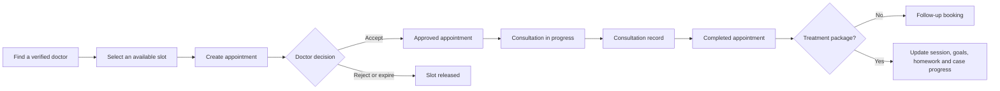

# MindBridge - Online Psychological Counseling Booking System

MindBridge (OPCBS) is a role-based web platform that connects patients with verified mental-health professionals. It supports the complete care journey: finding a doctor, booking an appointment, managing clinical schedules, maintaining consultation records, and monitoring structured treatment progress.

The solution is built with ASP.NET Core 8 using a layered architecture. The public website and role portals use Razor Pages, while business operations are exposed through a separate REST API.

> MindBridge supports counseling workflows but is not an emergency service and does not replace professional medical diagnosis or emergency care.

## Key Capabilities

### Discovery and booking

- Search and filter verified doctors by specialization, availability, and consultation format.
- View public doctor profiles, credentials, experience, reviews, and published articles.
- Book appointments as a registered patient or guest.
- Support online, in-person, and treatment-package appointments.
- Track, accept, reject, cancel, and reschedule appointments through controlled status transitions.
- Send email and in-app reminders for confirmations, upcoming appointments, follow-ups, and policy warnings.

### Doctor practice management

- Configure weekly availability and generate appointment slots.
- Review appointment requests and manage daily clinical schedules.
- Start and complete consultations with consultation-note requirements.
- Maintain patient records while enforcing doctor-patient ownership boundaries.
- Manage professional profiles, credentials, verification documents, and public visibility.
- Publish mental-health articles and communicate with patients securely.

### Structured treatment management

- Create reusable treatment-package templates and assign them to patients.
- Create a treatment case when a patient accepts a package.
- Link treatment sessions to appointments without exceeding package limits.
- Define treatment goals, goal details, success criteria, and progress history.
- Assign and review homework for individual treatment sessions.
- Consolidate consultation records, psychometric assessments, mood journals, and session evaluations.
- Automatically synchronize package, case, session, appointment, and progress states.

### Platform operations

- Verify doctor applications and review professional certificates.
- Moderate doctor-authored blog content.
- Manage users, roles, specializations, and service packages.
- Process doctor subscriptions through VNPay Sandbox.
- Handle user violation reports, supporting evidence, warnings, and account actions.
- Record audit logs and deliver real-time notifications.

## User Roles

| Role | Main responsibilities |
| --- | --- |
| Guest | Browse doctors and articles, create and track guest bookings |
| Patient | Manage appointments, treatment cases, homework, assessments, mood journals, favorites, and messages |
| Doctor | Manage schedules, appointments, consultation records, patients, treatment programs, profile, and content |
| Customer Support | Review doctor verification, moderate content, and process violation reports |
| Business Manager | Manage specializations and platform service packages |
| System Admin | Manage accounts and roles, review escalated reports, and inspect audit activity |

## Core Care Flow



Appointments, treatment sessions, and treatment cases are related but remain separate business records:

- An **appointment** represents a booked consultation time.
- A **treatment session** represents one planned clinical session within a treatment case.
- A **treatment case** is the active patient-doctor care program created from an accepted package snapshot.
- Cancelled appointments do not consume a package session; no-shows remain part of attendance history.

## Architecture

```text
OPCBS.Web            Razor Pages UI and API client services
       |
       v
OPCBS.Api            REST endpoints, JWT authentication, SignalR hubs
       |
       v
OPCBS.Application    Use cases, DTOs, validation, and business services
       |
       v
OPCBS.Domain         Entities, enums, constants, and domain contracts
       |
       v
OPCBS.Infrastructure EF Core, SQL Server, repositories, email, and file storage
```

The repository contains these projects:

| Project | Purpose |
| --- | --- |
| `OPCBS.Api` | ASP.NET Core Web API, Swagger, authentication, hubs, and background services |
| `OPCBS.Web` | Razor Pages application for public and role-specific experiences |
| `OPCBS.Application` | Application services, DTOs, interfaces, mapping, and validation |
| `OPCBS.Domain` | Core domain models, statuses, constants, and repository abstractions |
| `OPCBS.Infrastructure` | EF Core SQL Server persistence and external-service implementations |
| `OPCBS.Shared` | Shared response and cross-project utility models |
| `OPCBS.Tests` | xUnit unit and service-level tests |

## Technology Stack

- .NET 8 and ASP.NET Core Web API
- ASP.NET Core Razor Pages
- Entity Framework Core 8 and Microsoft SQL Server
- JWT Bearer authentication and role-based authorization
- SignalR for real-time messaging and notifications
- FluentValidation and AutoMapper
- Bootstrap 5 and Chart.js-based UI components
- Cloudinary for uploaded media and verification files
- MailKit/SMTP for transactional email
- VNPay Sandbox for doctor subscription payments
- xUnit, Moq, and Coverlet for automated testing

## Prerequisites

Install the following tools before running the project:

- [.NET 8 SDK](https://dotnet.microsoft.com/download/dotnet/8.0)
- Microsoft SQL Server or SQL Server Express
- SQL Server Management Studio (optional)
- Git
- `dotnet-ef` for manual migration commands (optional)

```powershell
dotnet tool install --global dotnet-ef
```

## Configuration

The API reads configuration from `backend/OPCBS/appsettings.json`, environment-specific settings, user secrets, and environment variables. The Web project reads the API address from `backend/OPCBS.Web/appsettings.json`.

Required configuration groups:

| Configuration | Purpose |
| --- | --- |
| `ConnectionStrings:DefaultConnection` | SQL Server connection string |
| `JwtSettings` | JWT secret, issuer, audience, and expiration |
| `SmtpSettings` | Email server and sender credentials |
| `Cloudinary` | Media-storage account credentials |
| `VnPay` | VNPay merchant and signature settings |
| `ApiSettings:BaseUrl` | API URL used by the Razor Pages project |

Use .NET user secrets or environment variables for credentials. Do not commit production secrets.

```powershell
cd backend/OPCBS
dotnet user-secrets init
dotnet user-secrets set "ConnectionStrings:DefaultConnection" "Server=YOUR_SERVER;Database=OPCBS;Trusted_Connection=True;TrustServerCertificate=True"
dotnet user-secrets set "JwtSettings:Secret" "YOUR_LONG_RANDOM_SECRET"
dotnet user-secrets set "SmtpSettings:Username" "YOUR_SMTP_USERNAME"
dotnet user-secrets set "SmtpSettings:Password" "YOUR_SMTP_PASSWORD"
dotnet user-secrets set "Cloudinary:CloudName" "YOUR_CLOUD_NAME"
dotnet user-secrets set "Cloudinary:ApiKey" "YOUR_API_KEY"
dotnet user-secrets set "Cloudinary:ApiSecret" "YOUR_API_SECRET"
```

The default local Web configuration expects the API at:

```json
{
  "ApiSettings": {
    "BaseUrl": "http://localhost:5152/"
  }
}
```

## Database Setup

Restore dependencies and apply the current EF Core migrations:

```powershell
dotnet restore backend/OPCBS.sln

dotnet ef database update `
  --project backend/OPCBS.Infrastructure/OPCBS.Infrastructure.csproj `
  --startup-project backend/OPCBS/OPCBS.Api.csproj
```

The API also applies pending migrations and initializes development seed data during startup. Use a dedicated development database and back up valuable data before changing migrations.

## Run Locally

Open two terminals from the repository root.

**Terminal 1 - API**

```powershell
dotnet run --project backend/OPCBS/OPCBS.Api.csproj --launch-profile http
```

**Terminal 2 - Web**

```powershell
dotnet run --project backend/OPCBS.Web/OPCBS.Web.csproj --launch-profile http
```

Local addresses:

| Application | URL |
| --- | --- |
| MindBridge Web | <http://localhost:5044> |
| OPCBS API | <http://localhost:5152> |
| Swagger UI | <http://localhost:5152/swagger> |

Start the API before the Web project so Razor Pages can reach the configured endpoints.

## Build and Test

```powershell
dotnet build backend/OPCBS.sln
dotnet test backend/OPCBS.Tests/OPCBS.Tests.csproj
```

Generate test coverage when needed:

```powershell
dotnet test backend/OPCBS.Tests/OPCBS.Tests.csproj `
  --collect:"XPlat Code Coverage"
```

## Background and Real-Time Processing

The API hosts two SignalR hubs:

- `/hubs/chat` for doctor-patient conversations.
- `/hubs/notifications` for live notification updates.

Hosted services maintain time-sensitive workflows, including appointment reminders, unanswered request expiration, no-show handling, recommended follow-ups, and treatment lifecycle synchronization. Persistent business records remain in SQL Server; SignalR only delivers live updates to connected clients.

## Security Notes

- Authentication uses signed JWT access tokens.
- API endpoints enforce role and resource-ownership checks.
- Passwords are hashed with BCrypt and are never stored as plain text.
- Clinical records must only be accessible to the patient and the doctor involved in that care relationship.
- Uploaded files should be validated by type, size, ownership, and secure Cloudinary identifiers.
- Audit logs record security-sensitive and administrative actions.
- Secrets must be supplied through user secrets or environment variables in non-local environments.
- Production deployments should use HTTPS, restricted CORS origins, secure cookies, rate limiting, database backups, and secret rotation.

## Repository Layout

```text
SEP_G32/
|-- backend/
|   |-- OPCBS/                 # API host
|   |-- OPCBS.Web/             # Razor Pages frontend
|   |-- OPCBS.Application/     # Application layer
|   |-- OPCBS.Domain/          # Domain layer
|   |-- OPCBS.Infrastructure/  # Data and external services
|   |-- OPCBS.Shared/          # Shared models
|   |-- OPCBS.Tests/           # Automated tests
|   `-- OPCBS.sln
|-- docs/                      # Supporting documents and UI references
`-- README.md
```

## Development Guidelines

1. Keep controllers thin and place business rules in application services.
2. Reuse domain statuses and role constants instead of magic numbers or strings.
3. Validate authorization with stable user, patient, and doctor identifiers rather than display names.
4. Keep appointment, treatment-session, and treatment-case transitions synchronized and auditable.
5. Add or update migrations whenever the persisted model changes.
6. Never include credentials, tokens, personal health information, or generated build output in commits.
7. Build the complete solution and run the relevant tests before merging into `main`.

## License and Academic Context

MindBridge was developed as the SEP_G32 software engineering project. Add the selected open-source or institutional license before distributing the source code publicly.
