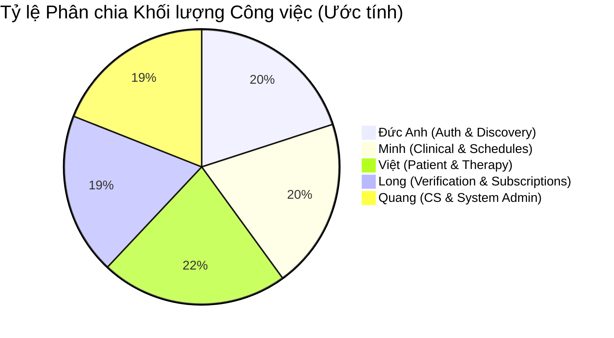

# Bảng Phân Công Công Việc Dự Án OPCBS (MindBridge)

Tài liệu này chi tiết hóa việc phân chia mã nguồn, chức năng và các tệp tin cụ thể cho 5 thành viên nhóm **SEP_G32** nhằm tối ưu hóa sự phối hợp, cân bằng khối lượng công việc, và tránh xung đột code (conflict) trong quá trình phát triển dự án **OPCBS (MindBridge)**.

---

## I. TỔNG QUAN PHÂN CHIA VAI TRÒ & KHỐI LƯỢNG CÔNG VIỆC

Để đảm bảo dự án chạy trơn tru, công việc được phân chia dựa trên tính gắn kết của các chức năng (cohesion) và khả năng độc lập của các trang Razor Pages.

| Thành viên | Vai trò & Module chính | Pages chính | Tỷ trọng |
|---|---|---|---|
| **Đức Anh** | Authentication, Doctor Discovery, Public Blog, Appointment Booking | `Account`, `Doctors`, `Blog`, `Appointment` (Patient Side) | **20%** |
| **Minh** | Doctor Appointment, Schedule, Consultation, Doctor Blog | `Doctor/Appointments`, `Schedules`, `ConsultationRecords` (Doctor Side), `Blogs` | **20%** |
| **Việt** | Patient Module, Patient Record, Treatment Package/Case, Review | `Patient`, `Doctor/TreatmentPackages` & `Doctor/TreatmentCases` | **22%** |
| **Long** | Doctor Registration, Verification Submission, Subscription, Business Manager | `Doctor/Verification`, `ServicePackages`, `Subscriptions`, `BusinessManager` | **19%** |
| **Quang** | Customer Support, Doctor Approval, Blog Moderation, System Admin | `CustomerSupport`, `Admin` | **19%** |

---

## II. RANH GIỚI PHỐI HỢP & LUỒNG NGHIỆP VỤ LIÊN MODULE

Một số quy trình nghiệp vụ đi qua module của hai hoặc nhiều người. Nhóm thống nhất ranh giới trách nhiệm như sau:

### 1. Luồng Xác minh Bác sĩ (Doctor Verification)
* **Long (Doctor Side):** 
  * Đăng ký tài khoản Bác sĩ -> Điền thông tin Profile (`Profile.cshtml`) -> Tải lên chứng chỉ hành nghề -> Gửi đơn xác minh (`Verification.cshtml`).
* **Quang (CS Side):** 
  * Xem danh sách đơn đang chờ duyệt -> Xem chi tiết thông tin và file chứng chỉ -> Bấm Phê duyệt (`Approve`) hoặc Từ chối (`Reject` kèm lý do).
* **Long (Doctor Side):** 
  * Xem kết quả phê duyệt (`VerificationStatus.cshtml`), nếu bị từ chối thì tiến hành chỉnh sửa hồ sơ và nộp lại.

### 2. Luồng Đặt lịch & Khám bệnh (Booking & Appointment Flow)
* **Đức Anh (Patient Booking):**
  * Thiết kế trang chọn bác sĩ (`Doctors/Details.cshtml`) -> Gọi API kiểm tra gói khám active -> Hiển thị slots rảnh -> Submit tạo booking (`Appointment/Book.cshtml`).
* **Minh (Doctor Clinic):**
  * Nhận thông báo lịch hẹn mới -> Duyệt/Từ chối cuộc hẹn -> Bắt đầu buổi khám (`InProgress`) -> Gọi Inline Modal tạo ghi chú tư vấn (`ConsultationNote`) -> Đổi trạng thái lịch hẹn sang `Completed`.
* **Việt (Patient Portal):**
  * Xem danh sách cuộc hẹn cá nhân -> Thực hiện Hủy/Đổi lịch hẹn (`Reschedule.cshtml` tuân thủ chính sách 24h) -> Xem kết quả bệnh án/lời khuyên sau buổi khám -> Gửi đánh giá bác sĩ (`Reviews/Create.cshtml`).

### 3. Luồng Gói điều trị & Ca điều trị (Treatment Package & Case)
* **Minh (Doctor Consultation):**
  * Khám bệnh xong và đề xuất bệnh nhân cần tham gia trị liệu theo gói.
* **Việt (Package & Case Owner):**
  * Bác sĩ tạo đề xuất gói điều trị (`Doctor/TreatmentPackages`) -> Bệnh nhân nhận thông báo -> Bệnh nhân Đồng ý/Từ chối gói khám (`Patient/TreatmentPackages`).
  * Khi bệnh nhân chấp nhận gói khám -> Tự động kích hoạt Ca điều trị (`TreatmentCase`) -> Đồng bộ trừ số buổi khi đặt lịch -> Bác sĩ giao bài tập về nhà -> Bệnh nhân ghi nhật ký cảm xúc -> Theo dõi tiến độ mục tiêu trị liệu (Goals).
  * *Lưu ý:* Việt sở hữu toàn bộ các trang và API của cả Treatment Package và Treatment Case ở cả hai phía Doctor & Patient để tránh xung đột mã nguồn.

### 4. Luồng Đăng ký Dịch vụ nền tảng & Thanh toán VNPay (Service Subscription)
* **Long (Business Manager & Doctor):**
  * Business Manager tạo các gói dịch vụ (`BusinessManager/ServicePackages`) -> Bác sĩ xem và đăng ký mua gói (`Doctor/ServicePackages`) -> Chuyển hướng sang VNPay Sandbox -> Nhận callback VNPay kích hoạt Subscription (`Doctor/Subscriptions/PaymentCallback`).
* **Quang (System Admin):**
  * Chỉ quản trị danh sách người dùng và cấu hình tham số hệ thống chung, không can thiệp vào luồng thanh toán và đăng ký của bác sĩ.

### 5. Luồng Quản lý bài viết (Blog Workflow)
* **Minh (Doctor Blog Writer):**
  * Bác sĩ viết bài nháp -> Gửi yêu cầu CS duyệt bài viết (`Doctor/Blogs`).
* **Quang (CS Moderation):**
  * Xem danh sách bài viết chờ duyệt -> Phê duyệt (`Approve`) để xuất bản hoặc Từ chối (`Reject` kèm lý do).
* **Đức Anh (Public Blog):**
  * Hiển thị bài viết đã duyệt ra trang chủ, trang Blog công cộng để Guest/Patient đọc và bình luận (`Blog/Index`, `Blog/Details`).

---

## III. CHI TIẾT TỪNG THÀNH VIÊN VÀ FILE MÃ NGUỒN CỤ THỂ

### 1. Đức Anh - Authentication & Doctor Discovery
Chịu trách nhiệm về bảo mật đầu vào, giao diện công cộng tìm kiếm bác sĩ, xem blog và luồng đặt lịch hẹn ban đầu của Bệnh nhân.

* **Razor Pages (Frontend):**
  * [Login.cshtml[.cs]](file:///c:/SEP_G32/SEP_G32/backend/OPCBS.Web/Pages/Account/Login.cshtml) - Đăng nhập tài khoản.
  * [Register.cshtml[.cs]](file:///c:/SEP_G32/SEP_G32/backend/OPCBS.Web/Pages/Account/Register.cshtml) - Đăng ký bệnh nhân.
  * [RegisterDoctor.cshtml[.cs]](file:///c:/SEP_G32/SEP_G32/backend/OPCBS.Web/Pages/Account/RegisterDoctor.cshtml) - Đăng ký bác sĩ ban đầu.
  * [VerifyOtp.cshtml[.cs]](file:///c:/SEP_G32/SEP_G32/backend/OPCBS.Web/Pages/Account/VerifyOtp.cshtml) - Xác thực mã OTP qua Email.
  * [ForgotPassword.cshtml[.cs]](file:///c:/SEP_G32/SEP_G32/backend/OPCBS.Web/Pages/Account/ForgotPassword.cshtml) - Yêu cầu đặt lại mật khẩu.
  * [ResetPassword.cshtml[.cs]](file:///c:/SEP_G32/SEP_G32/backend/OPCBS.Web/Pages/Account/ResetPassword.cshtml) - Tạo mật khẩu mới.
  * [ChangePassword.cshtml[.cs]](file:///c:/SEP_G32/SEP_G32/backend/OPCBS.Web/Pages/Account/ChangePassword.cshtml) - Đổi mật khẩu trong Portal.
  * [Doctors/Index.cshtml[.cs]](file:///c:/SEP_G32/SEP_G32/backend/OPCBS.Web/Pages/Doctors/Index.cshtml) - Tìm kiếm & lọc bác sĩ công cộng.
  * [Doctors/Details.cshtml[.cs]](file:///c:/SEP_G32/SEP_G32/backend/OPCBS.Web/Pages/Doctors/Details.cshtml) - Xem thông tin chi tiết bác sĩ, chuyên khoa, đánh giá.
  * [Blog/Index.cshtml[.cs]](file:///c:/SEP_G32/SEP_G32/backend/OPCBS.Web/Pages/Blog/Index.cshtml) - Danh sách bài viết blog công cộng.
  * [Blog/Details.cshtml[.cs]](file:///c:/SEP_G32/SEP_G32/backend/OPCBS.Web/Pages/Blog/Details.cshtml) - Chi tiết bài viết & phần bình luận.
  * [Appointment/Book.cshtml[.cs]](file:///c:/SEP_G32/SEP_G32/backend/OPCBS.Web/Pages/Appointment/Book.cshtml) - Chọn slot và submit đặt lịch.
* **Services & Controllers (Backend):**
  * `AuthService.cs` - Xử lý logic băm mật khẩu, tạo JWT token, xác thực OTP.
  * `AuthApiService.cs` - Gateway gọi API Auth từ Web Client.
  * `AuthController.cs` - API Controller quản lý định tuyến đăng nhập/đăng ký.
  * `DoctorAppointmentServices.cs` (Phương thức `CreateAppointmentAsync`).

---

### 2. Minh - Doctor Practice & Clinical Workflow
Chịu trách nhiệm về lịch làm việc của Bác sĩ, tiếp nhận cuộc hẹn, thực hiện khám bệnh ghi nhận hồ sơ và viết bài Blog chia sẻ kiến thức chuyên môn.

* **Razor Pages (Frontend):**
  * [Doctor/Appointments/Index.cshtml[.cs]](file:///c:/SEP_G32/SEP_G32/backend/OPCBS.Web/Pages/Doctor/Appointments/Index.cshtml) - Quản lý danh sách cuộc hẹn của Bác sĩ (card layout, filter).
  * [Doctor/Appointments/Details.cshtml[.cs]](file:///c:/SEP_G32/SEP_G32/backend/OPCBS.Web/Pages/Doctor/Appointments/Details.cshtml) - Chi tiết buổi khám, hồ sơ bệnh nhân, tích hợp Modal tạo bệnh án.
  * [Doctor/Schedules/Index.cshtml[.cs]](file:///c:/SEP_G32/SEP_G32/backend/OPCBS.Web/Pages/Doctor/Schedules/Index.cshtml) - Quản lý lịch rảnh (Slots), khóa/mở slot, thiết lập ngày nghỉ.
  * [Doctor/ConsultationNotes/Create.cshtml[.cs]](file:///c:/SEP_G32/SEP_G32/backend/OPCBS.Web/Pages/Doctor/ConsultationNotes/Create.cshtml) - Trang viết ghi chú tư vấn độc lập (Walk-in).
  * [Doctor/ConsultationNotes/Edit.cshtml[.cs]](file:///c:/SEP_G32/SEP_G32/backend/OPCBS.Web/Pages/Doctor/ConsultationNotes/Edit.cshtml) - Sửa đổi ghi chú tư vấn, phân quyền visibility.
  * [Doctor/Blogs/Index.cshtml[.cs]](file:///c:/SEP_G32/SEP_G32/backend/OPCBS.Web/Pages/Doctor/Blogs/Index.cshtml) - Danh sách bài viết của riêng bác sĩ.
* **Services & Controllers (Backend):**
  * `DoctorAppointmentServices.cs` (Phần `ApproveAppointmentAsync`, `CompleteAppointmentAsync`, `RejectAppointmentAsync` và Quản lý Schedule/Slot).
  * `BusinessServices.cs` (Phần `ConsultationNoteService` và `BlogPostService`).
  * `SchedulesController.cs` - API quản lý Slots/Schedules.
  * `AppointmentsController.cs` - API quản lý trạng thái cuộc hẹn.
  * `BlogsReviewsController.cs` (API `ConsultationNotesController` và `BlogPostsController`).

---

### 3. Việt - Patient Portal & Treatment Cases
Chịu trách nhiệm về luồng trải nghiệm của Bệnh nhân, hồ sơ bệnh án cá nhân, và toàn bộ hệ thống Ca điều trị chuyên sâu (Treatment Cases/Packages) bao gồm bài tập trị liệu, nhật ký cảm xúc.

* **Razor Pages (Frontend):**
  * [Patient/Appointments/Index.cshtml[.cs]](file:///c:/SEP_G32/SEP_G32/backend/OPCBS.Web/Pages/Patient/Appointments/Index.cshtml) - Danh sách lịch hẹn của Bệnh nhân (stat cards).
  * [Patient/Appointments/Details.cshtml[.cs]](file:///c:/SEP_G32/SEP_G32/backend/OPCBS.Web/Pages/Patient/Appointments/Details.cshtml) - Xem chi tiết cuộc hẹn, kết quả bài test tâm lý, nút làm lại test.
  * [Patient/Appointments/Reschedule.cshtml[.cs]](file:///c:/SEP_G32/SEP_G32/backend/OPCBS.Web/Pages/Patient/Appointments/Reschedule.cshtml) - Thay đổi giờ hẹn (chính sách 24h).
  * [Patient/ConsultationRecords/Index.cshtml[.cs]](file:///c:/SEP_G32/SEP_G32/backend/OPCBS.Web/Pages/Patient/ConsultationRecords/Index.cshtml) - Xem các bệnh án được chia sẻ từ bác sĩ (`PatientVisible`).
  * [Doctor/TreatmentPackages/*](file:///c:/SEP_G32/SEP_G32/backend/OPCBS.Web/Pages/Doctor/TreatmentPackages) - Bác sĩ đề xuất gói điều trị cho bệnh nhân.
  * [Patient/TreatmentPackages/*](file:///c:/SEP_G32/SEP_G32/backend/OPCBS.Web/Pages/Patient/TreatmentPackages) - Bệnh nhân phê duyệt/từ chối gói khám.
  * [Doctor/TreatmentCases/*](file:///c:/SEP_G32/SEP_G32/backend/OPCBS.Web/Pages/Doctor/TreatmentCases) - Bác sĩ quản lý tiến độ, buổi trị liệu, giao bài tập của Ca điều trị.
  * [Patient/TreatmentCases/*](file:///c:/SEP_G32/SEP_G32/backend/OPCBS.Web/Pages/Patient/TreatmentCases) - Dashboard theo dõi ca điều trị của Bệnh nhân.
  * [Patient/Journal/*](file:///c:/SEP_G32/SEP_G32/backend/OPCBS.Web/Pages/Patient/Journal) - Bệnh nhân ghi nhật ký cảm xúc hàng ngày.
  * [Patient/Therapy/*](file:///c:/SEP_G32/SEP_G32/backend/OPCBS.Web/Pages/Patient/Therapy) - Bệnh nhân nộp bài tập trị liệu được giao.
  * [Patient/Psychometrics/*](file:///c:/SEP_G32/SEP_G32/backend/OPCBS.Web/Pages/Patient/Psychometrics) - Làm bài trắc nghiệm sàng lọc tâm lý (PHQ-9, GAD-7,...).
  * [Patient/Favorites/Index.cshtml[.cs]](file:///c:/SEP_G32/SEP_G32/backend/OPCBS.Web/Pages/Patient/Favorites/Index.cshtml) - Danh sách bác sĩ yêu thích.
  * [Patient/Reviews/Create.cshtml[.cs]](file:///c:/SEP_G32/SEP_G32/backend/OPCBS.Web/Pages/Patient/Reviews/Create.cshtml) - Bệnh nhân đánh giá bác sĩ sau cuộc hẹn.
* **Services & Controllers (Backend):**
  * `DoctorAppointmentServices.cs` (Phần `CancelAppointmentAsync` và `RescheduleAppointmentAsync`).
  * `TreatmentPackageService.cs` - Quản lý nghiệp vụ đề xuất/chấp nhận gói điều trị.
  * `TreatmentCaseService.cs` - Quản lý ca điều trị, tạo buổi trị liệu, timeline, tiến trình.
  * `TherapyServices.cs` - Giao bài tập, chấm điểm, mood journal, nộp kết quả test.
  * `FavoriteDoctorService.cs` - Quản lý danh sách yêu thích.
  * `TreatmentCaseController.cs` - API của Ca điều trị.
  * `TherapyController.cs` - API của bài tập trị liệu và nhật ký.
  * `FavoritesController.cs` - API yêu thích.

---

### 4. Long - Doctor Verification & Platform Service Subscriptions
Chịu trách nhiệm về hồ sơ hành nghề của Bác sĩ, đăng ký gói dịch vụ nền tảng, tích hợp VNPay Sandbox, và quản trị kinh doanh của Business Manager.

* **Razor Pages (Frontend):**
  * [Doctor/Verification.cshtml[.cs]](file:///c:/SEP_G32/SEP_G32/backend/OPCBS.Web/Pages/Doctor/Verification.cshtml) - Đăng ký chuyên khoa và nộp chứng chỉ chứng minh năng lực.
  * [Doctor/VerificationStatus.cshtml[.cs]](file:///c:/SEP_G32/SEP_G32/backend/OPCBS.Web/Pages/Doctor/VerificationStatus.cshtml) - Hiển thị trạng thái đơn duyệt (Approved/Rejected kèm lý do).
  * [Doctor/Profile.cshtml[.cs]](file:///c:/SEP_G32/SEP_G32/backend/OPCBS.Web/Pages/Doctor/Profile.cshtml) - Quản lý thông tin hồ sơ hiển thị công cộng của Bác sĩ.
  * [Doctor/ServicePackages/*](file:///c:/SEP_G32/SEP_G32/backend/OPCBS.Web/Pages/Doctor/ServicePackages) - Bác sĩ xem và đăng ký gói dịch vụ hoạt động.
  * [Doctor/Subscriptions/*](file:///c:/SEP_G32/SEP_G32/backend/OPCBS.Web/Pages/Doctor/Subscriptions) - Quản lý lịch sử thanh toán, trang callback xử lý chữ ký bảo mật VNPay.
  * [BusinessManager/*](file:///c:/SEP_G32/SEP_G32/backend/OPCBS.Web/Pages/BusinessManager) - Cổng của BM quản trị Specializations, Service Packages và Analytics báo cáo doanh thu.
* **Services & Controllers (Backend):**
  * `BusinessServices.cs` (Phần `DoctorVerificationService`, `SpecializationService`, `ServicePackageAdminService`).
  * `VnPayService.cs` - Thực thi tạo chuỗi ký SHA512, tạo URL thanh toán, xác minh chữ ký IPN/Callback.
  * `PatientRecordService.cs` - Quản lý hồ sơ bệnh nhân của bác sĩ.
  * `PatientRecordsController.cs` - API quản lý hồ sơ.

---

### 5. Quang - Customer Support & System Administration
Chịu trách nhiệm kiểm duyệt nội dung (duyệt bác sĩ, duyệt blog) và quản trị hệ thống (tài khoản, phân quyền, cấu hình hệ thống, nhật ký hoạt động).

* **Razor Pages (Frontend):**
  * [CustomerSupport/DoctorApplications/*](file:///c:/SEP_G32/SEP_G32/backend/OPCBS.Web/Pages/CustomerSupport/DoctorApplications) - CS duyệt chứng chỉ bác sĩ (tích hợp inline PDF/Image viewer).
  * [CustomerSupport/BlogModeration/*](file:///c:/SEP_G32/SEP_G32/backend/OPCBS.Web/Pages/CustomerSupport/BlogModeration) - CS kiểm duyệt bài viết chuyên môn của bác sĩ.
  * [Admin/Users/*](file:///c:/SEP_G32/SEP_G32/backend/OPCBS.Web/Pages/Admin/Users) - Admin quản lý tài khoản người dùng, khóa/mở khóa tài khoản.
  * [Admin/Roles/*](file:///c:/SEP_G32/SEP_G32/backend/OPCBS.Web/Pages/Admin/Roles) - Admin cấu hình phân quyền vai trò.
  * [Admin/AuditLogs/*](file:///c:/SEP_G32/SEP_G32/backend/OPCBS.Web/Pages/Admin/AuditLogs) - Admin xem nhật ký hoạt động hệ thống chi tiết.
  * [Admin/Settings.cshtml[.cs]](file:///c:/SEP_G32/SEP_G32/backend/OPCBS.Web/Pages/Admin/Settings.cshtml) - Cấu hình tham số (System Configs) như SMTP, session timeout, bảo trì.
* **Services & Controllers (Backend):**
  * `BusinessServices.cs` (Phần duyệt của CS: `ApproveVerificationAsync`, `RejectVerificationAsync`, `ApproveBlogAsync`, `RejectBlogAsync`).
  * `BusinessServices.cs` (Phần Admin: `AdminService` thực hiện khóa tài khoản, xem audit logs, cấu hình configs).
  * `AdminController.cs` - API của quản trị viên (nếu có).

---

## IV. NGUYÊN TẮC LÀM VIỆC CHUNG TRÁNH XUNG ĐỘT (GIT & CODE CONFLICT)

Do một số tệp tin chứa cấu hình dùng chung cho toàn bộ dự án, các thành viên cần tuân thủ các nguyên tắc sau để tránh đè code (overwrite):

1. **Tệp tin dùng chung DbContext (`OpcbsDbContext.cs`):**
   * Khi thêm DbSet hoặc Fluent API cấu hình bảng mới, hãy thêm vào cuối phương thức `OnModelCreating` hoặc tách riêng thành các phương thức extension (ví dụ: `ConfigureTreatmentCaseEntities`).
2. **Đăng ký Dependency Injection (`Program.cs` & Extension Files):**
   * Phân chia đăng ký rõ ràng theo từng Layer. Chỉ chỉnh sửa phần Service của mình.
3. **Ánh xạ đối tượng (`MappingProfile.cs`):**
   * Chỉ thêm các dòng Map của thực thể thuộc module mình phụ trách.
4. **Header Navigation (`_Header.cshtml`):**
   * Cập nhật các menu điều hướng trong Dropdown Profile theo đúng vai trò mà mình quản lý. Tránh sửa đổi CSS/Cấu trúc chung của Header.
5. **Quy trình Git:**
   * Mỗi thành viên làm việc trên một nhánh (branch) tính năng riêng biệt (ví dụ: `feature/auth-ducanh`, `feature/therapy-viet`,...).
   * Pull code mới nhất từ nhánh chính (`Quang` hoặc `main`) trước khi bắt đầu viết code mới và trước khi tạo Pull Request.
